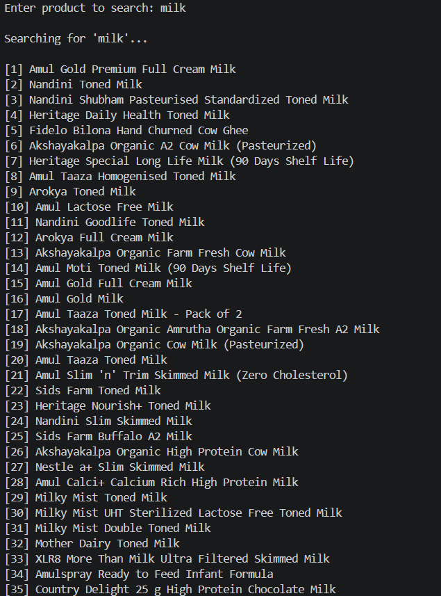
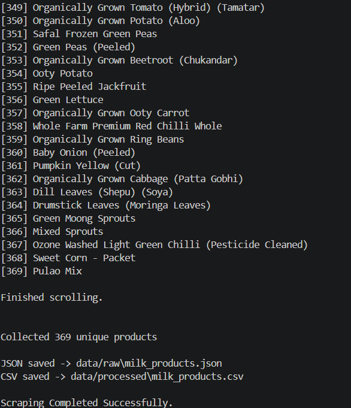
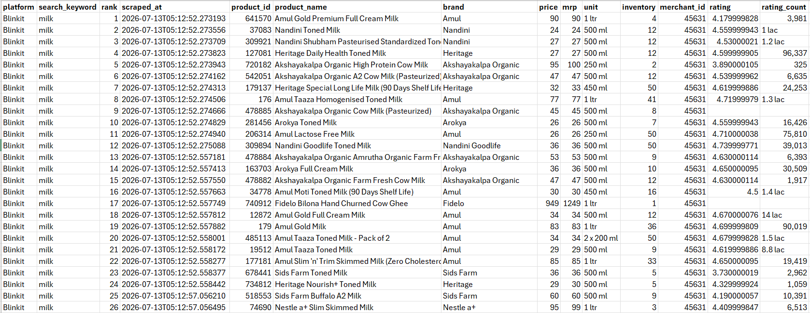

# 🛒 Quick Commerce Product Intelligence

An end-to-end Product Analytics project that collects, processes, and analyzes real-time product data from India's leading quick-commerce platforms.

> **Current Platform:** Blinkit  
> **Upcoming:** Zepto | Swiggy Instamart

---

# 🎯 Project Objective

Build a Product Intelligence platform capable of collecting, processing, and analyzing product data to answer business questions such as:

- Which brands dominate search results?
- Which products provide the best value?
- How are products priced across brands?
- Which products have the highest inventory?
- Which products receive the highest customer ratings?
- How does product assortment vary across brands?

## Terminal Execution

This project combines **Web Scraping, Data Engineering, Feature Engineering, Data Analysis, and Business Intelligence** into a single analytics workflow.



### Product Collection Progress



---

# 🚀 Current Features

## ✅ Dynamic Product Search

Search any product directly from the terminal.

Example:

```text
Enter product to search:
milk
```

---

## ✅ Automated Browser Interaction

- Opens Blinkit automatically
- Searches for the entered keyword
- Performs infinite scrolling
- Collects all available products

---

## ✅ API Interception

Instead of scraping HTML, the project captures Blinkit's internal Search API responses using Playwright.

This makes the scraper:

- Faster
- More reliable
- Easier to maintain

---

## ✅ Data Cleaning

The scraper automatically:

- Removes duplicate products
- Extracts required fields
- Creates a normalized dataset

---

## ✅ JSON Export

Raw API response is stored as:

```text
data/raw/milk_products.json
```

---

## ✅ CSV Export

Processed product data is exported as:

```text
data/processed/milk_products.csv
```

Ready for analysis using Pandas or Power BI.

### Sample Dataset

Below is a preview of the processed dataset generated by the scraper.



---

# 📂 Project Structure

```text
quick-commerce-product-intelligence/

│
├── analysis/
│   └── product_analysis.py
│
├── scrapers/
│   └── blinkit_capture.py
│
├── data/
│   ├── raw/
│   │     milk_products.json
│   │
│   ├── processed/
│   │     milk_products.csv
│   │
│   └── final/
│
├── docs/
│
├── notebooks/
│
├── utils/
│
├── README.md
├── requirements.txt
└── .gitignore
```

---

# 📊 Data Fields Collected

Each product contains information such as:

- Platform
- Search Keyword
- Product ID
- Product Name
- Brand
- Price
- MRP
- Unit
- Inventory
- Merchant ID
- Rating
- Rank
- Scraped Timestamp

---

# 📊 Sample Output

The scraper generates two files after every successful execution:

- **Raw JSON** → `data/raw/milk_products.json`
- **Processed CSV** → `data/processed/milk_products.csv`

The processed dataset is ready for further analysis using Pandas, SQL, or Power BI.

# ⚙️ Tech Stack

### Programming

- Python

### Libraries

- Playwright
- Pandas

### Tools

- Git
- GitHub
- VS Code

### Upcoming

- Power BI
- SQLite

---

# ▶️ How to Run

## Clone Repository

```bash
git clone https://github.com/Adityasah256/quick-commerce-product-intelligence.git
```

---

## Install Dependencies

```bash
pip install -r requirements.txt
```

---

## Install Playwright Browser

```bash
playwright install
```

---

## Run Scraper

```bash
python scrapers/blinkit_capture.py
```

Example:

```text
Enter product to search:
milk
```

---

# 📈 Current Workflow

```text
User enters product

        │

        ▼

Blinkit opens automatically

        │

        ▼

Search executed

        │

        ▼

Infinite scrolling

        │

        ▼

Search API captured

        │

        ▼

Product extraction

        │

        ▼

Duplicate removal

        │

        ▼

Structured dataset

        │

        ▼

JSON + CSV Export
```

---

# 📌 Current Project Status

✅ Dynamic Search

✅ Infinite Scroll

✅ API Interception

✅ Modular Scraper

✅ JSON Export

✅ CSV Export

✅ GitHub Repository

✅ ETL Pipeline

---

# 🚀 Roadmap

## Version 1.1

- Feature Engineering
- Discount %
- Price Segmentation
- Inventory Buckets
- Stock Status

---

## Version 1.2

- Multi-category scraping
- Bread
- Eggs
- Paneer
- Chips
- Rice
- Beverages

---

## Version 2.0

Multi-platform support

- Blinkit
- Zepto
- Swiggy Instamart

---

## Version 2.5

Historical Price Tracking

- Price changes
- Inventory changes
- Ranking changes

---

## Version 3.0

Interactive Power BI Dashboard

- Brand Analysis
- Price Analysis
- Search Ranking
- Inventory Distribution
- Customer Ratings
- Product Assortment
- Business Insights

---

# 💡 Business Use Cases

This project can be used for:

- Product Analytics
- Competitive Intelligence
- Pricing Analysis
- Assortment Analysis
- Category Performance
- Inventory Monitoring
- Business Intelligence
- Data Visualization

---

# 👨‍💻 Author

**Aditya Sah**

Aspiring Product Analyst | Data Analyst

GitHub:
https://github.com/Adityasah256

LinkedIn:
https://www.linkedin.com/in/aditya-sah07

---

⭐ If you found this project interesting, feel free to star the repository!
