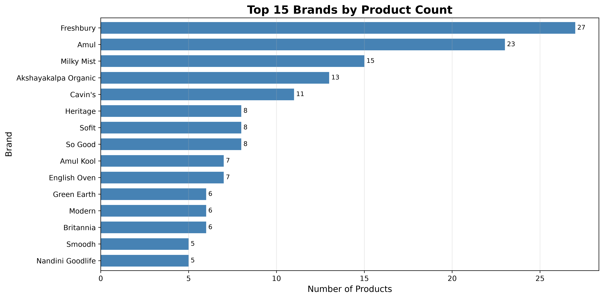
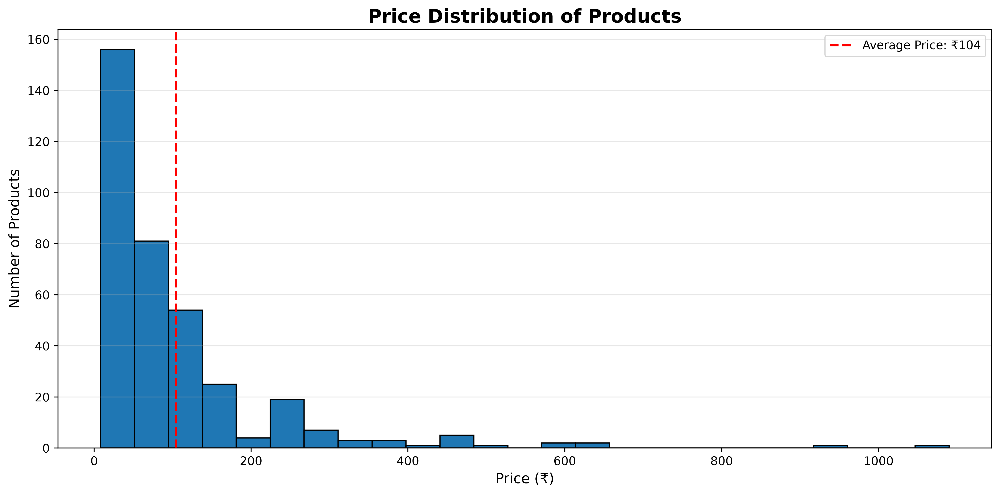
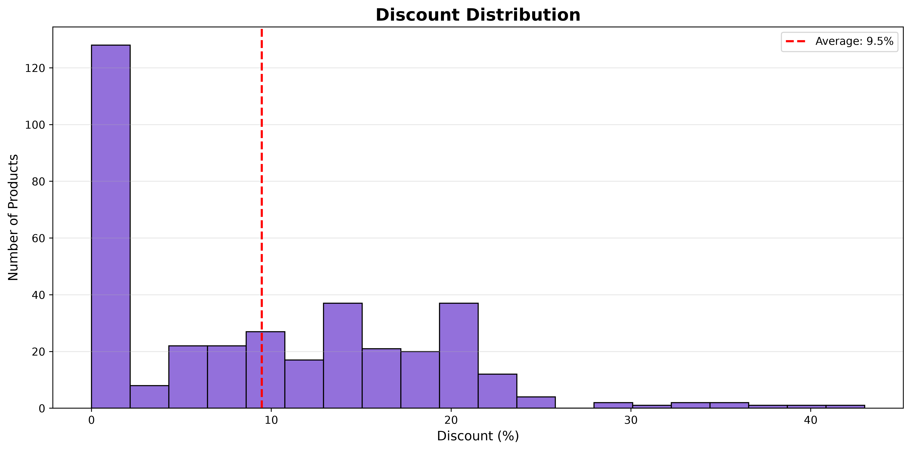
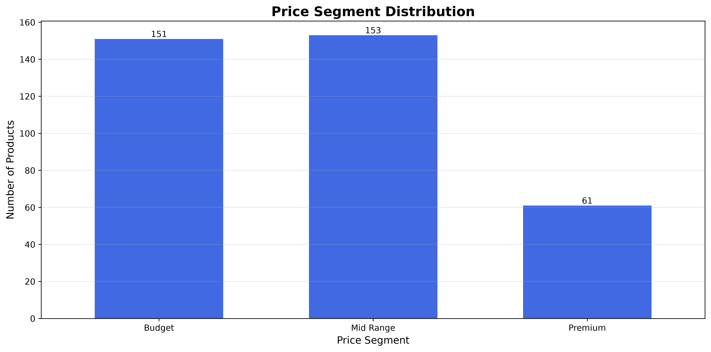

# 🛒 Quick Commerce Product Intelligence


An end-to-end **Product Analytics Platform** that collects, processes, analyzes, and visualizes real-time product data from India's leading Quick Commerce platforms.

The project combines **Web Scraping**, **Data Engineering**, **Feature Engineering**, **Product Analytics**, and **Business Intelligence** into a single analytics workflow capable of generating actionable insights from real-world e-commerce data.

> **Current Platform:** Blinkit  
> **Upcoming Platforms:** Zepto • Swiggy Instamart

---

# 🎯 Project Objective

Modern quick-commerce platforms generate enormous amounts of product data every day.

This project aims to build a scalable Product Intelligence platform capable of answering business questions such as:

- Which brands dominate a product category?
- How are products priced across competitors?
- Which products provide the highest customer value?
- Which products have the highest inventory availability?
- How are discounts distributed across the catalogue?
- Which price segments dominate the assortment?
- Which brands consistently maintain higher customer ratings?

The long-term vision is to evolve this into a multi-platform intelligence platform capable of monitoring Blinkit, Zepto, and Swiggy Instamart for competitive product analysis.

---

# 🏗️ Analytics Pipeline

```text
                   User Search

                        │

                        ▼

             Playwright Web Scraper

                        │

                        ▼

             Blinkit Search API Capture

                        │

                        ▼

                Raw JSON Dataset

                        │

                        ▼

            Processed Product Dataset

                        │

                        ▼

             Feature Engineering Engine

                        │

                        ▼

             Analytics Dataset Builder

                        │

                        ▼

            Product Analytics Engine

                        │

                        ▼

           Automated Visual Analytics

                        │

                        ▼

              Business Intelligence
```

---

# 🚀 Current Features

## 🌐 Data Collection

- ✅ Dynamic Product Search
- ✅ Automated Browser Interaction
- ✅ Infinite Scrolling
- ✅ Playwright API Interception
- ✅ Duplicate Product Removal
- ✅ Structured Data Extraction

---

## ⚙️ Data Engineering

- ✅ Raw JSON Export
- ✅ Processed CSV Export
- ✅ Modular ETL Pipeline
- ✅ Reusable Data Processing
- ✅ Analytics Dataset Generation

---

## 🧠 Feature Engineering

Automatically generates business-ready analytical features including:

- ✅ Discount Percentage
- ✅ Savings
- ✅ Inventory Bucket
- ✅ Stock Status
- ✅ Price Segment
- ✅ Rating Bucket
- ✅ Value Score (Custom KPI)

---

## 📈 Product Analytics Engine

Automatically generates:

- ✅ Executive Summary
- ✅ Brand Analysis
- ✅ Pricing Analysis
- ✅ Inventory Analysis
- ✅ Customer Insights
- ✅ Value Analysis
- ✅ Business Recommendations

Output:

```text
reports/
└── analytics_report.txt
```

---

## 📊 Automated Visual Analytics

Automatically generates high-resolution business charts.

Current Visualizations:

- ✅ Brand Distribution
- ✅ Price Distribution
- ✅ Inventory Distribution
- ✅ Rating Distribution
- ✅ Discount Distribution
- ✅ Value Score Distribution
- ✅ Price Segment Distribution

Every visualization includes:

- Automated chart generation
- Dynamic business insights
- High-resolution PNG export
- Consistent styling
- Portfolio-ready output

---

# 📷 Project Preview

## Terminal Execution

The project executes the complete analytics workflow directly from the terminal.


---

## Product Collection Progress


---

## Sample Dataset

The processed dataset generated after ETL.


---

# 📂 Project Structure

```text
quick-commerce-product-intelligence/

│
├── analysis/
│   ├── feature_engineering.py
│   ├── product_analysis.py
│   └── visualizations.py
│
├── assets/
│   ├── charts/
│   │   ├── brand_distribution.png
│   │   ├── price_distribution.png
│   │   ├── inventory_distribution.png
│   │   ├── rating_distribution.png
│   │   ├── discount_distribution.png
│   │   ├── value_score_distribution.png
│   │   └── price_segment_distribution.png
│   │
│   ├── terminal_output_1.png
│   ├── terminal_output_2.png
│   └── sample_dataset.png
│
├── data/
│   ├── raw/
│   │   └── milk_products.json
│   │
│   ├── processed/
│   │   └── milk_products.csv
│   │
│   └── final/
│       └── analytics_dataset.csv
│
├── reports/
│   └── analytics_report.txt
│
├── scrapers/
│   └── blinkit_capture.py
│
├── docs/
├── notebooks/
├── utils/
│
├── README.md
├── CHANGELOG.md
├── LICENSE
├── requirements.txt
└── .gitignore
```

---

# 📊 Product Analytics Engine

After feature engineering, the analytics engine performs a complete analysis of the product catalogue.

Generated Sections:

- Executive Summary
- Brand Analysis
- Pricing Analysis
- Inventory Analysis
- Customer Insights
- Value Analysis
- Business Recommendations

The analytics report is automatically generated after execution.

```text
reports/
└── analytics_report.txt
```

---

## Sample Executive Summary

```text
Total Products      : 365
Total Brands        : 94
Average Price       : ₹104.10
Average Rating      : 4.36
Average Discount    : 9.47%
Average Inventory   : 7.15
```

---

# 📊 Automated Visual Analytics

The Visual Analytics Engine converts the analytics dataset into business-ready visualizations.

Generated automatically:

- Brand Distribution
- Price Distribution
- Inventory Distribution
- Rating Distribution
- Discount Distribution
- Value Score Distribution
- Price Segment Distribution

Every chart is:

- Automatically generated
- Saved as PNG
- High Resolution (400 DPI)
- Accompanied by dynamic business insights

Output Directory:

```text
assets/
└── charts/
```

---

# 📸 Sample Visualizations

| Brand Distribution | Price Distribution |
|--------------------|-------------------|
|  |  |

| Discount Distribution | Price Segment Distribution |
|------------------------|---------------------------|
|  |  |
---

# 📁 Generated Outputs

Running the complete pipeline produces the following outputs:

| Output | Description |
|---------|-------------|
| `milk_products.json` | Raw API response |
| `milk_products.csv` | Cleaned product dataset |
| `analytics_dataset.csv` | Feature-engineered dataset |
| `analytics_report.txt` | Business analytics report |
| `assets/charts/*.png` | Automated visualizations |

---

# 🔄 End-to-End Workflow

```text
Product Search

        │

        ▼

Blinkit Web Scraping

        │

        ▼

Search API Interception

        │

        ▼

Raw JSON Dataset

        │

        ▼

Processed CSV Dataset

        │

        ▼

Feature Engineering

        │

        ▼

Analytics Dataset

        │

        ▼

Product Analytics Report

        │

        ▼

Visual Analytics

        │

        ▼

Business Insights
```

---

# ⚙️ Tech Stack

## Programming Language

- Python 3.13

---

## Data Collection

- Playwright
- Blinkit Search API

---

## Data Processing

- Pandas

---

## Data Visualization

- Matplotlib

---

## Development Tools

- Git
- GitHub
- Visual Studio Code

---

## Upcoming Technologies

- Power BI
- Zepto Search API
- Swiggy Instamart Search API

---

# ▶️ Installation

## Clone the Repository

```bash
git clone https://github.com/Adityasah256/quick-commerce-product-intelligence.git

cd quick-commerce-product-intelligence
```

---

## Install Dependencies

```bash
pip install -r requirements.txt
```

---

## Install Playwright Browser

```bash
playwright install
```

---

# 🚀 Usage

## Step 1 — Run the Scraper

```bash
python scrapers/blinkit_capture.py
```

Example:

```text
Enter product to search:

milk
```

This generates:

- Raw JSON dataset
- Processed CSV dataset

---

## Step 2 — Feature Engineering

```bash
python analysis/feature_engineering.py
```

This generates:

```text
data/final/
└── analytics_dataset.csv
```

---

## Step 3 — Product Analytics

```bash
python analysis/product_analysis.py
```

This generates:

```text
reports/
└── analytics_report.txt
```

---

## Step 4 — Visual Analytics

```bash
python analysis/visualizations.py
```

This automatically generates:

- Brand Distribution
- Price Distribution
- Inventory Distribution
- Rating Distribution
- Discount Distribution
- Value Score Distribution
- Price Segment Distribution

Output:

```text
assets/charts/
```

---

# 📦 Generated Outputs

After executing the complete pipeline, the following artifacts are produced.

| File | Description |
|------|-------------|
| `milk_products.json` | Raw Blinkit Search API response |
| `milk_products.csv` | Cleaned product dataset |
| `analytics_dataset.csv` | Feature engineered dataset |
| `analytics_report.txt` | Automated business report |
| `brand_distribution.png` | Brand visualization |
| `price_distribution.png` | Price visualization |
| `inventory_distribution.png` | Inventory visualization |
| `rating_distribution.png` | Rating visualization |
| `discount_distribution.png` | Discount visualization |
| `value_score_distribution.png` | Value Score visualization |
| `price_segment_distribution.png` | Price Segment visualization |

---

# 📌 Current Project Status

## ✅ Sprint 1 — Data Collection

- Dynamic Product Search
- Infinite Scrolling
- Playwright API Interception
- Duplicate Removal
- JSON Export
- CSV Export

---

## ✅ Sprint 2 — Feature Engineering

- Discount Percentage
- Savings
- Inventory Bucket
- Stock Status
- Price Segment
- Rating Bucket
- Value Score

---

## ✅ Sprint 3 — Product Analytics

- Executive Summary
- Brand Analysis
- Pricing Analysis
- Inventory Analysis
- Customer Insights
- Value Analysis
- Business Recommendations

---

## ✅ Sprint 3.5 — Automated Visual Analytics

- Brand Distribution
- Price Distribution
- Inventory Distribution
- Rating Distribution
- Discount Distribution
- Value Score Distribution
- Price Segment Distribution

---

## 🔄 Next Milestone

Sprint 4 — Interactive Power BI Dashboard

---

# 🗺️ Project Roadmap

## ✅ Sprint 1

### Data Collection Pipeline

- Dynamic Search
- Infinite Scroll
- API Interception
- ETL Pipeline

---

## ✅ Sprint 2

### Feature Engineering Engine

- Analytical Feature Generation
- KPI Creation
- Dataset Standardization

---

## ✅ Sprint 3

### Product Analytics Engine

- Executive Summary
- Business Insights
- Recommendation Engine

---

## ✅ Sprint 3.5

### Automated Visual Analytics

- Business-ready Charts
- Dynamic Insight Generation
- PNG Export Engine

---

## 🔄 Sprint 4

### Interactive Power BI Dashboard

- Executive Dashboard
- KPI Cards
- Filters & Slicers
- Interactive Visualizations
- Product Intelligence Dashboard

---

## ⏳ Sprint 5

### Multi-platform Intelligence

Support for:

- Blinkit
- Zepto
- Swiggy Instamart

Comparative Analytics:

- Price Comparison
- Assortment Comparison
- Brand Comparison
- Discount Comparison

---

## ⏳ Sprint 6

### Historical Product Intelligence

- Daily Snapshots
- Price Tracking
- Inventory Tracking
- Rank Tracking
- Trend Analysis

---

# 💼 Business Use Cases

This project demonstrates how Product Analytics can be applied to solve real-world business problems in the Quick Commerce industry.

The platform can be used for:

- Product Analytics
- Competitive Intelligence
- Pricing Strategy
- Assortment Analysis
- Inventory Monitoring
- Customer Rating Analysis
- Category Benchmarking
- Business Intelligence
- Market Research
- Retail Analytics

---

# 🌟 Key Highlights

- ✅ Real-time product data collection using Playwright
- ✅ API-based data extraction for reliable scraping
- ✅ Modular ETL pipeline
- ✅ Automated Feature Engineering
- ✅ Product Analytics Engine
- ✅ Automated Visual Analytics
- ✅ Dynamic business insight generation
- ✅ High-resolution chart exports
- ✅ Scalable architecture for multi-platform analytics

---

# 📊 Business Questions Answered

The platform automatically answers questions such as:

- Which brands dominate a product category?
- Which products provide the best customer value?
- How are products distributed across price segments?
- Which products receive the highest ratings?
- How are discounts distributed across the catalogue?
- Which inventory bucket contains the majority of products?
- Which brands maintain the largest product assortment?
- Which products should be prioritized for promotional campaigns?

---

# 🔮 Future Enhancements

## 🔄 Sprint 4 — Interactive Power BI Dashboard

- Executive KPI Dashboard
- Product Performance Dashboard
- Brand Performance Dashboard
- Pricing Dashboard
- Inventory Dashboard
- Customer Rating Dashboard
- Interactive Filters & Slicers

---

## ⏳ Sprint 5 — Multi-platform Intelligence

Platform Support:

- Blinkit
- Zepto
- Swiggy Instamart

Comparative Analytics:

- Price Comparison
- Brand Comparison
- Rating Comparison
- Discount Comparison
- Assortment Comparison

---

## ⏳ Sprint 6 — Historical Product Intelligence

- Daily Product Snapshots
- Price Tracking
- Inventory Tracking
- Product Ranking Trends
- Discount Tracking
- Historical Analytics Dashboard

---

# 🤝 Contributing

Contributions, suggestions, and feature requests are always welcome.

If you'd like to contribute:

1. Fork the repository
2. Create your feature branch
3. Commit your changes
4. Push the branch
5. Open a Pull Request

---

# 📄 License

This project is licensed under the **MIT License**.

See the `LICENSE` file for more details.

---

# 👨‍💻 Author

## Aditya Sah

**Aspiring Product Analyst | Data Analyst**

Passionate about building data-driven products using Product Analytics, Automation, and Business Intelligence.

### Connect with me

**GitHub**

https://github.com/Adityasah256

**LinkedIn**

https://www.linkedin.com/in/aditya-sah07

---

# ⭐ Support the Project

If you found this project useful, consider:

- ⭐ Starring the repository
- 🍴 Forking the project
- 💡 Suggesting improvements
- 🤝 Sharing your feedback

Your support motivates further development and continuous improvement.

---

# 🚀 Current Project Status

### ✅ Completed

- Playwright-powered Blinkit Scraper
- Modular ETL Pipeline
- Feature Engineering Engine
- Product Analytics Engine
- Automated Visual Analytics

### 🔄 Currently Working On

**Sprint 4 — Interactive Power BI Dashboard**

Building an interactive dashboard with KPIs, filters, business insights, and executive-level visualizations.

---

> **Quick Commerce Product Intelligence** is an ongoing Product Analytics portfolio project focused on building a scalable analytics platform for India's quick-commerce ecosystem.
